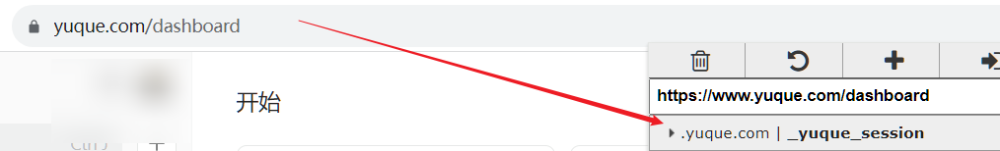

# 语雀备份工具

这是一个用于备份语雀文档的工具，它能够将你在语雀上创建的文档下载到本地，并保存为Markdown格式，同时图片也会保存到本地，对LaTeX公式进行了提取，以公式的形式保存在Markdown中。

## 安装

### 环境要求

- python3(需要用到requests,uuid等库，若没有安装请按照报错补上)

### 步骤

1. 克隆该项目到本地：

```bash
git clone https://github.com/tinaxinoo/yuque_backup_tool.git
```

2. 进入项目目录：

```bash
cd yuque_backup_tool
```

3. 修改配置：

```bash
修改yuapi.py中的_yuque_session
```

4. 使用

运行以下命令来开始备份你的语雀文档：

```bash
python main.py
```

备份的文档将保存在项目目录下的 `语雀备份` 文件夹中。

## 注意事项

- 请保护好你的session，不要将其泄露给他人。

- 备份大量文档可能需要一些时间，请耐心等待备份过程完成。

## 常见问题

**1. 如何获取语雀访问令牌？**
在语雀网页端登录账号后，在cookie中找到_yuque_session

**2. 下载图片报错**
由于使用正则匹配图片链接，但是链接中有一些意想不到的字符导致匹配失败，获取链接不完整，无法下载图片。可以在语雀中找到这张图片然后重新上传。

